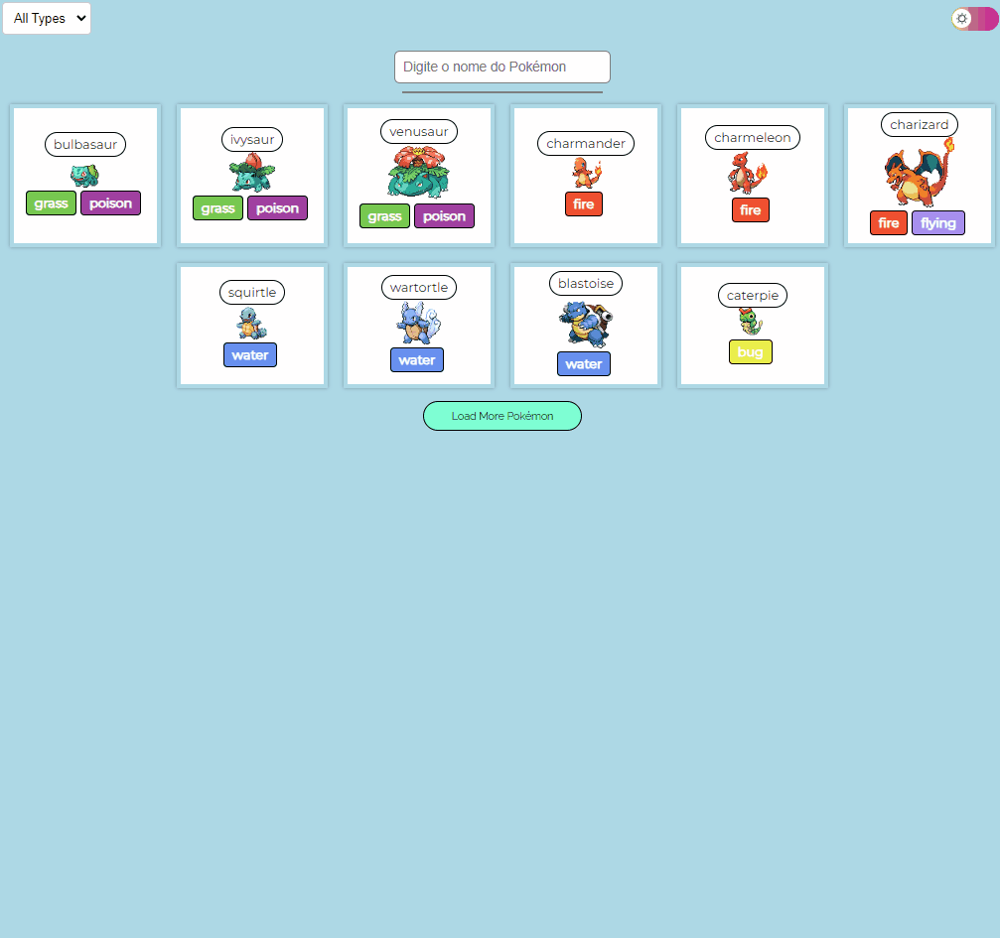
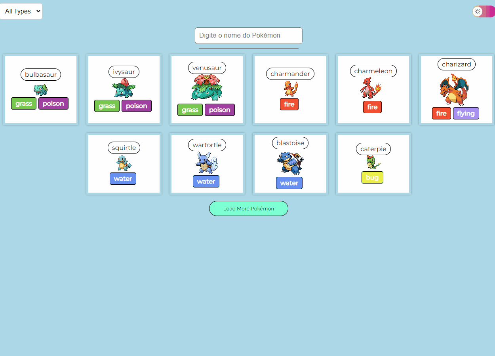
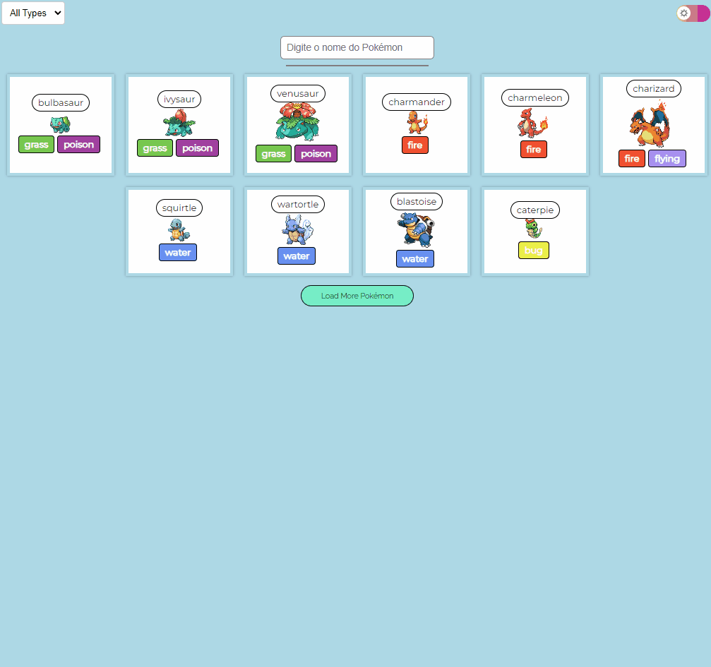

# Projeto Pokédex


O projeto é uma aplicação de página única (SPA) desenvolvida em React.js e utiliza vários componentes reutilizáveis para criar uma experiência interativa para os usuários. Ele se conecta à API PokeAPI para obter dados sobre os Pokémon, como nomes, tipos e imagens. Os temas claro e escuro estão disponíveis para a interface do usuário, e os usuários podem carregar mais Pokémon à medida que navegam pela lista. É uma aplicação divertida e informativa para os fãs de Pokémon!

## Índice
- <a href="#📱funcionalidades-do-projetofuncionalidades">Funcionalidades do projeto </a>
 - <a href="#como-rodar-este-projeto">Como rodar este projeto? </a>
- <a href="#🛠️-tecnologias-utilizadas">Tecnologias utilizadas </a>


## 📱Funcionalidades Do Projeto

#### Barra de Pesquisa
- [x] Permite aos usuários pesquisar Pokémon pelo nome.
- [x] Fornece sugestões à medida que o usuário digita.




#### Botão de Alternância de Tema
- [x] Oferece suporte a dois temas: claro e escuro.




#### Lista de Filtro
- [x] Permite aos usuários filtrar Pokémon com base em seus tipos.


#### Detail Page
- [x] Permite aos usuários ver detalhes completos de um Pókemon.





#### Botão de Carregamento Adicional
- [x] Permite aos usuários expandir a lista de Pokémon.
- [x] Carrega mais 10 Pokémon de cada vez.


## Como rodar este Projeto?
```bash
# Clone este Repositório
$git clone LinkRepo

# Instale as depêndencias
$npm install

#execute a aplicação
$npm run start

```
## 🛠️ Tecnologias Utilizadas
1. [react](https://react.dev/)
2. [react Router](https://reactrouter.com/en/main)
3. [react autosuggest](https://react-autosuggest.js.org/)